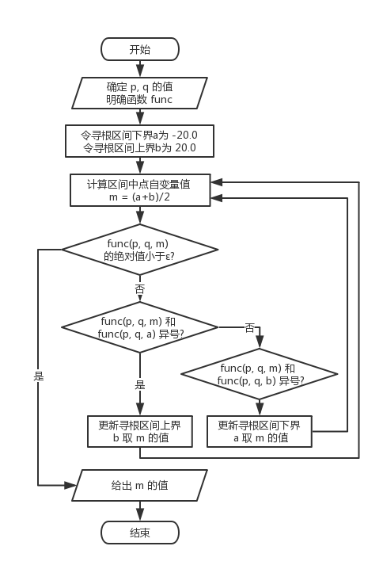

# 软件工程第一次作业-41911173-段言杰

# 二分搜索算法

## 二分搜索算法概述
>二分搜索算法，也称折半查找算法，即在一个有序数组中查找某一个特定元素。整个搜索过程从中间开始，如果要查找的元素即中间元素，那么搜索过程结束；反之根据中间元素与要查找元素的关系在数组对应的那一半查找，例如查找元素大于中间元素，则在整个数组较大元素的那一半查找，反复进行这个过程，直到找到元素，或者数组为空，查找不到元素。

## 二分搜索算法思想
假如有一组数为3，12，24，36，55，68，75，88要查给定的值24.可设三个变量front，mid，end分别指向数据的上界，中间和下界，**mid=(front+end)/2**。  
1. 开始令front=0(指向3)，end=7(指向88)，则mid=3(指向36)。因为a[mid]>x，故应在前半段中查找。
2. 令新的end=mid-1=2，而front=0不变，则新的mid=1。此时x>a[mid]，故确定应在后半段中查找。
3. 令新的front=mid+1=2，而end=2不变，则新的mid=2，此时a[mid]=x，查找成功。
如果要查找的数不是数列中的数，例如x=25，当第三次判断时，x>a[mid]，按以上规律，令front=mid+1，即front=3，出现front>end的情况，表示查找不成功

## 二分搜索算法图解


## 二分搜索算法c语言实现
```
#include <stdio.h>
#include <stdlib.h>

void binaryS(int key,int a[],int n)
{
    int high,low,mid;
    int flag=0;//查找成功的次数
    while(low<high){
        mid=(low+high)/2;
        if(key<a[mid]){	
            a[high]=a[mid-1];
        }
        if(key>a[mid]){
            a[low]=a[mid+1];
        }
        if(key==a[mid]){
            printf("查找成功 %d\n",key);
            flag++;
        }
    }
    if(flag=0){
        printf("失败\n");
    }
}

int main()
{
    int n,i,key;  
    int a[66];  
	scanf("%d",&n);
    for(i=0;i<n;i++){
        scanf("%d",&a[i]);
    }
    scanf("%d",&key);
    binaryS(key,a,n);
    return 0;
}
```
## 二分搜索算法复杂度
- 时间复杂度：
    1. 最坏情况查找最后一个元素(或者第一个元素)Master定理T(n)=T(n/2)+O(1)所以T(n)=O(log2n)
    2. 最好情况查找中间元素O(1)查找的元素即为中间元素(奇数长度数列的正中间，偶数长度数列的中间靠左的元素)
- 空间复杂度：S(n)=logn

